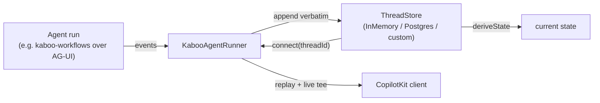

# Concepts

The architecture behind kaboo-runtime in one page.

## The event log is the source of truth

kaboo-runtime makes the **server** the custodian of conversation history. Every
AG-UI event a run emits is appended to the thread's log **verbatim and in
order** — messages, tool calls, `STATE_SNAPSHOT`, and the `ACTIVITY_SNAPSHOT` /
`CUSTOM` events a rich UI needs. Nothing is compacted or summarized. Everything
else — messages, current state, the activity tree — is *derived* from that log,
never stored separately.

## The three seams

| Piece | Role |
|-------|------|
| `KabooAgentRunner` | A CopilotKit `AgentRunner` that records every run and replays a thread's log on reconnect. |
| `ThreadStore` | The pluggable persistence interface — `InMemoryThreadStore`, `PostgresThreadStore`, or your own. |
| `deriveState` | Reconstructs current state from an event log (last `STATE_SNAPSHOT` wins), used identically by every store. |

## Replay on reconnect

`connect(threadId)` replays the thread's stored log, then tees any in-flight
run: if nothing is running it emits the stored events and completes; if a run is
in flight it emits the stored prior turns and then forwards live events. That is
what lets a browser reload — or a second tab — rebuild the full transcript and
keep watching live work.

## Server-owned history

kaboo-workflows folds each turn's `kaboo_history` into its trailing
`STATE_SNAPSHOT`. Before every run, `KabooAgentRunner` reads the thread's
persisted state and merges it into `input.state`, so multi-agent history is
seeded from the server — the browser no longer carries conversation history.

For the full detail (including `hydrate()` after a cold start), see
[Replay & state](replay-and-state.md).

## Where it sits in the stack

kaboo-runtime is the persistence/orchestration layer of the
[kaboo stack](https://gl-pgege.github.io/kaboo-docs/): agents authored with
[kaboo-workflows](https://gl-pgege.github.io/kaboo-workflows/) stream over
AG-UI, kaboo-runtime persists and replays that stream, and
[kaboo-react](https://gl-pgege.github.io/kaboo-react/) renders it.
